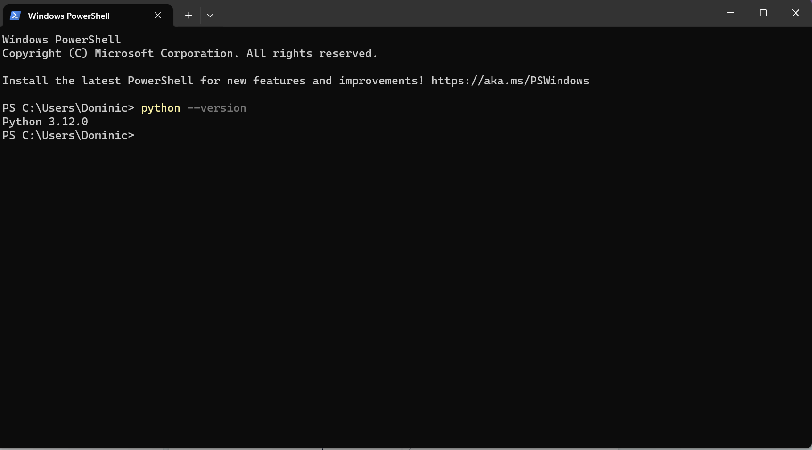
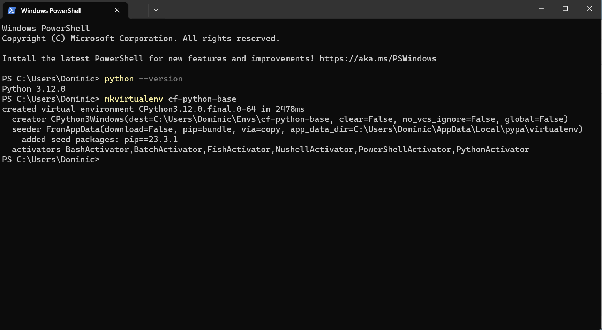
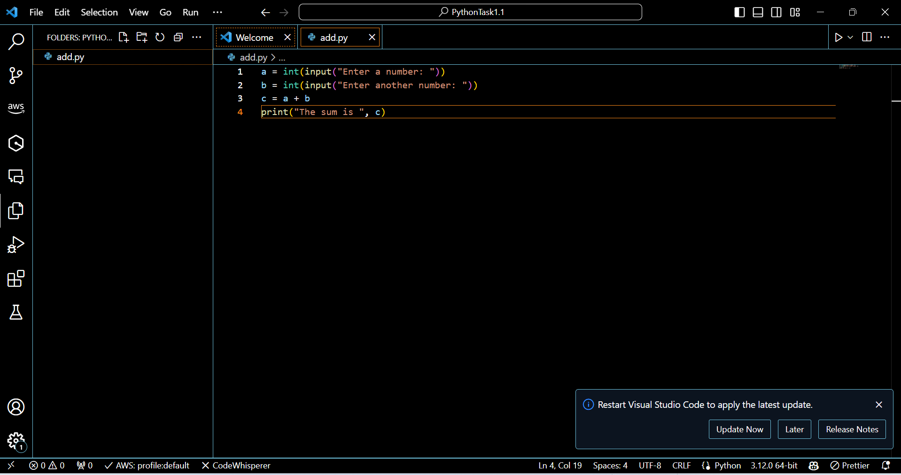
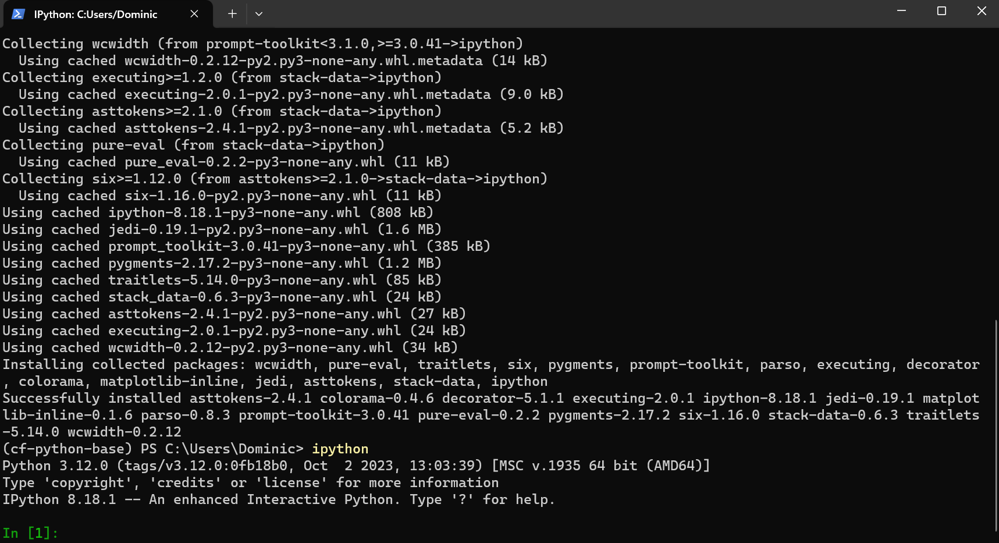

# Getting Started With Python

## Install Python
Install Python. Check the python version using `python --version`.

## Setup a New Virtual Environment
Create a new virtual environment named "cf-python-base"

## Create Script in VS Code
Create a Python file called "add.py" that asks user to input two numbers and prints the sum of those two numbers.

## Setup IPython Shell
In the virtual environment "cf-python-base" install Ipython

## Export Requirements File
Create a requirements text file inside cf-python-base using `pip freeze > requirements.txt`. Then create a new virtual environment called "cf-python-copy." Install the packages from requirements.txt.
.png)
.png)
